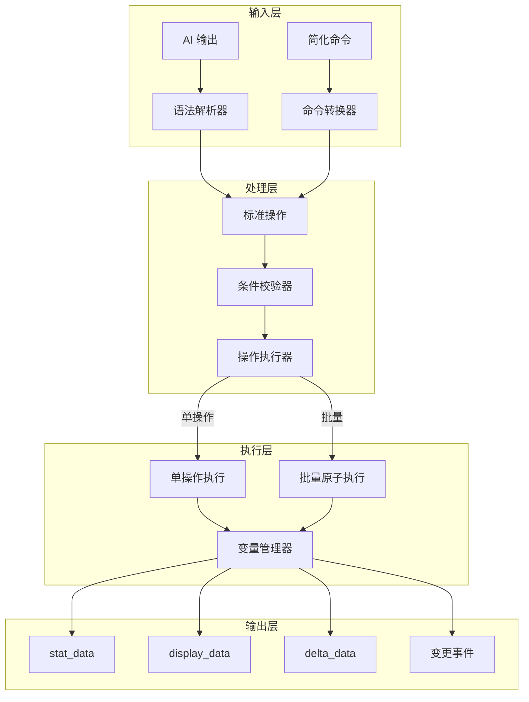

# 变量操作语法优化设计

## 1. 设计目标

参考 **Minecraft 指令系统** 和 **JSON Patch (RFC 6902)** 的优点，优化 EasyDynamicPrompts 的变量操作语法：

| 来源 | 借鉴特性 |
|------|---------|
| Minecraft | `/data` 命令风格、变量间运算、条件执行 |
| JSON Patch | 标准化操作、test 校验、批量原子操作、move/copy |

## 2. 主要命令格式：`/data` 命令

采用 **Minecraft 风格的 `/data` 命令**，直观、简洁、易于 AI 输出：

```bash
# 设置变量
/data set 角色.络络.好感度 50
/data set 角色.络络.好感度 55 test 50    # 带旧值校验

# 数值增减
/data add 角色.络络.好感度 5
/data add 角色.络络.好感度 -3

# 数组操作
/data push 背包 "治疗药水"
/data insert 背包 0 "重要物品"
/data remove 背包.0

# 移动/复制
/data move 临时.物品 背包/-
/data copy 模板.技能 角色.技能

# 变量运算
/data calc 总伤害 "基础伤害 + 装备加成"

# 数组/对象修改
/data modify 背包 append "新物品"
/data modify 角色.属性 merge {"力量": 10}

# 条件测试
/data test 角色.HP gte 0
/data test 角色.状态 eq "正常"
/data test 角色.buff exists
```

## 3. 支持的命令列表

| 命令 | 格式 | 说明 |
|------|------|------|
| `set` | `/data set <path> <value> [test <oldValue>]` | 设置值，可选旧值校验 |
| `add` | `/data add <path> <delta>` | 数值增减 |
| `push` | `/data push <path> <value>` | 数组尾部追加 |
| `insert` | `/data insert <path> <index> <value>` | 数组指定位置插入 |
| `remove` | `/data remove <path>` | 删除值 |
| `move` | `/data move <from> <to>` | 移动值 |
| `copy` | `/data copy <from> <to>` | 复制值 |
| `calc` | `/data calc <path> "<expr>"` | 变量运算 |
| `modify` | `/data modify <path> <action> <value>` | 数组/对象修改 |
| `test` | `/data test <path> <condition> [value]` | 条件测试 |

## 4. 备用格式

### 4.1 JSON 块格式

支持 AI 输出结构化 JSON：

```xml
<UpdateVariable>
[
  { "op": "replace", "path": "角色.络络.好感度", "value": 55 },
  { "op": "add", "path": "角色.络络.标签/-", "value": "友好" },
  { "op": "remove", "path": "临时标记" }
]
</UpdateVariable>
```

### 4.2 旧函数调用格式（向后兼容）

```javascript
_.set('角色.络络.好感度', 50)
_.add('角色.络络.好感度', 5)
_.push('背包', '新物品')
```

## 5. 条件测试

### 5.1 /data test 命令

```bash
# 比较条件
/data test 角色.HP eq 100        # 等于
/data test 角色.HP neq 0         # 不等于
/data test 角色.HP gt 50         # 大于
/data test 角色.HP gte 50        # 大于等于
/data test 角色.HP lt 50         # 小于
/data test 角色.HP lte 50        # 小于等于

# 存在性检查
/data test 角色.buff exists      # 存在
```

### 5.2 条件对象（JSON 格式）

```javascript
// 条件表达式
{
  path: "角色.HP",
  gte: 50           // 大于等于 50
}

// 逻辑组合
{
  and: [
    { path: "角色.HP", gte: 50 },
    { path: "角色.MP", gte: 10 }
  ]
}

{
  or: [
    { path: "角色.状态", eq: "正常" },
    { path: "角色.buff", exists: true }
  ]
}

{
  not: { path: "角色.状态", eq: "死亡" }
}
```

## 6. 变量运算

### 6.1 /data calc 命令

```bash
# 基本运算
/data calc 总伤害 "基础伤害 + 装备加成"
/data calc 最终价格 "原价 * 0.8"
/data calc 剩余HP "角色.HP - 受到伤害"

# 支持的运算符
# + 加法
# - 减法
# * 乘法
# / 除法
# % 取模
# () 括号
```

## 7. 数组/对象修改

### 7.1 /data modify 命令

```bash
# 数组操作
/data modify 背包 append "新物品"           # 尾部追加
/data modify 背包 prepend "重要物品"        # 头部追加
/data modify 背包 insert 2 "物品"           # 指定位置插入
/data modify 背包 merge ["物品1", "物品2"]  # 合并数组

# 对象合并
/data modify 角色.属性 merge {"力量": 10, "敏捷": 15}
```

## 8. AI 输出格式

### 8.1 推荐格式：/data 命令

```markdown
AI回复内容...

/data add 角色.络络.好感度 5
/data push 角色.络络.记忆 "玩家帮助了络络"
/data set 角色.络络.状态 "开心"
```

### 8.2 JSON 块格式

```markdown
AI回复内容...

<UpdateVariable>
[
  {"op": "increment", "path": "角色.络络.好感度", "delta": 5},
  {"op": "add", "path": "角色.络络.记忆/-", "value": "玩家帮助了络络"},
  {"op": "replace", "path": "角色.络络.状态", "value": "开心"}
]
</UpdateVariable>
```

## 5. 路径语法

### 5.1 标准路径格式

采用点号 + 数组索引的混合格式（兼顾可读性）：

```
角色.络络.好感度         # 嵌套对象属性
背包.0                   # 数组第一个元素
背包.-1                  # 数组最后一个元素
背包/-                   # 数组末尾（用于 add 追加）
角色.技能.火球术.等级    # 深层嵌套
```

### 5.2 JSON Pointer 兼容

同时支持标准 JSON Pointer 格式：

```
/角色/络络/好感度
/背包/0
/背包/-
```

## 6. 类型定义

```typescript
// 基础操作
type Operation = 
  | AddOperation
  | RemoveOperation
  | ReplaceOperation
  | MoveOperation
  | CopyOperation
  | TestOperation
  | IncrementOperation
  | CalcOperation
  | ModifyOperation;

interface AddOperation {
  op: 'add';
  path: string;
  value: any;
  if?: Condition;
}

interface RemoveOperation {
  op: 'remove';
  path: string;
  if?: Condition;
}

interface ReplaceOperation {
  op: 'replace';
  path: string;
  value: any;
  if?: Condition;
}

interface MoveOperation {
  op: 'move';
  from: string;
  path: string;
  if?: Condition;
}

interface CopyOperation {
  op: 'copy';
  from: string;
  path: string;
  if?: Condition;
}

interface TestOperation {
  op: 'test';
  path: string;
  value?: any;
  // 或使用条件
  eq?: any;
  neq?: any;
  gt?: number;
  gte?: number;
  lt?: number;
  lte?: number;
}

// 扩展操作
interface IncrementOperation {
  op: 'increment';
  path: string;
  delta: number;
  if?: Condition;
}

interface CalcOperation {
  op: 'calc';
  path: string;
  expr: string;  // 表达式，如 "变量A + 变量B"
  if?: Condition;
}

interface ModifyOperation {
  op: 'modify';
  path: string;
  action: 'append' | 'prepend' | 'insert' | 'merge';
  value: any;
  index?: number;  // insert 时使用
  if?: Condition;
}

// 条件
interface Condition {
  path: string;
  eq?: any;
  neq?: any;
  gt?: number;
  gte?: number;
  lt?: number;
  lte?: number;
  in?: any[];
  nin?: any[];
  match?: string;
  exists?: boolean;
}

interface LogicalCondition {
  and?: (Condition | LogicalCondition)[];
  or?: (Condition | LogicalCondition)[];
  not?: Condition | LogicalCondition;
}
```

## 7. 实现架构



## 8. 向后兼容

| 旧语法 | 新语法 | 说明 |
|--------|--------|------|
| `_.set('path', value)` | `_.set('path', value)` | 保持不变 |
| `_.set('path', newVal, oldVal)` | `_.set('path', newVal, {test: oldVal})` | 选项式旧值校验 |
| `_.add('path', delta)` | `_.add('path', delta)` | 保持不变 |
| `_.assign('arr', val)` | `_.push('arr', val)` | 更清晰的语义 |
| `_.remove('path', key)` | `_.remove('path.key')` 或 `_.remove('path', key)` | 都支持 |

## 9. 示例场景

### 9.1 战斗系统

```javascript
// 计算伤害并更新状态
_.batch([
  // 检查攻击者有足够的 MP
  { op: 'test', path: '角色.MP', gte: 10 },
  // 消耗 MP
  { op: 'increment', path: '角色.MP', delta: -10 },
  // 计算伤害
  { op: 'calc', path: '临时.伤害', expr: '角色.攻击力 - 敌人.防御力' },
  // 应用伤害
  { op: 'calc', path: '敌人.HP', expr: '敌人.HP - 临时.伤害' },
  // 清理临时变量
  { op: 'remove', path: '临时.伤害' }
], { atomic: true })
```

### 9.2 物品交易

```javascript
// 购买物品
_.batch([
  // 检查金币足够
  { op: 'test', path: '玩家.金币', gte: 100 },
  // 扣除金币
  { op: 'increment', path: '玩家.金币', delta: -100 },
  // 添加物品到背包
  { op: 'add', path: '玩家.背包/-', value: { 名称: '治疗药水', 数量: 1 } }
], { atomic: true })
```

### 9.3 关系系统

```javascript
// 好感度变化触发状态更新
_.batch([
  // 增加好感度
  { op: 'increment', path: '角色.络络.好感度', delta: 10 },
  // 条件更新关系状态
  { 
    op: 'replace', 
    path: '角色.络络.关系', 
    value: '朋友',
    if: { path: '角色.络络.好感度', gte: 50 }
  },
  // 记录事件
  { op: 'add', path: '角色.络络.记忆/-', value: '${date}: 好感度提升' }
])
```

## 10. 下一步

1. [ ] 实现新的操作解析器
2. [ ] 实现条件校验系统
3. [ ] 实现批量原子操作
4. [ ] 实现变量间运算
5. [ ] 更新文档和示例
6. [ ] 向后兼容测试